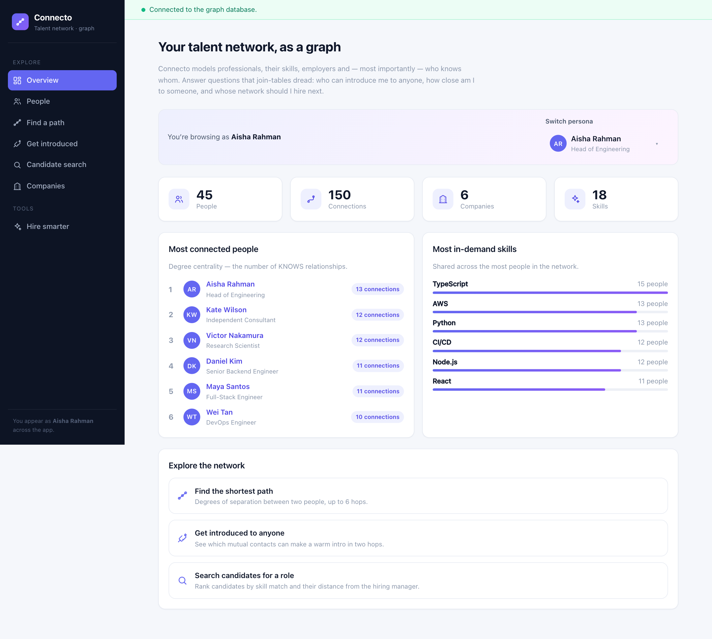
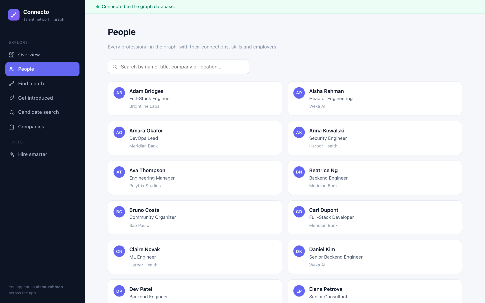
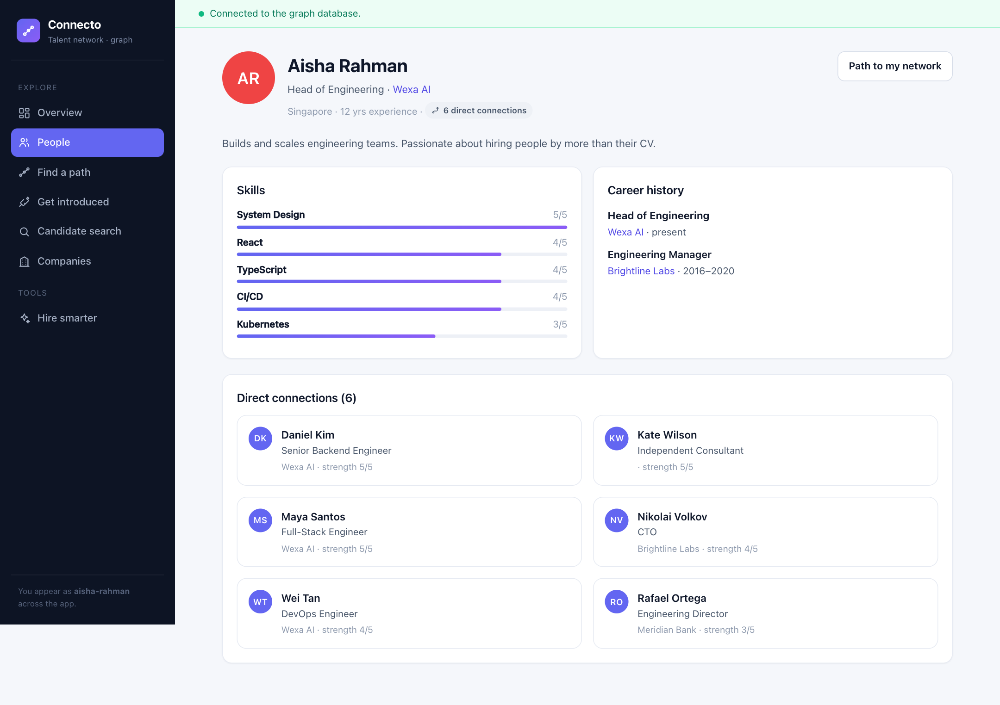
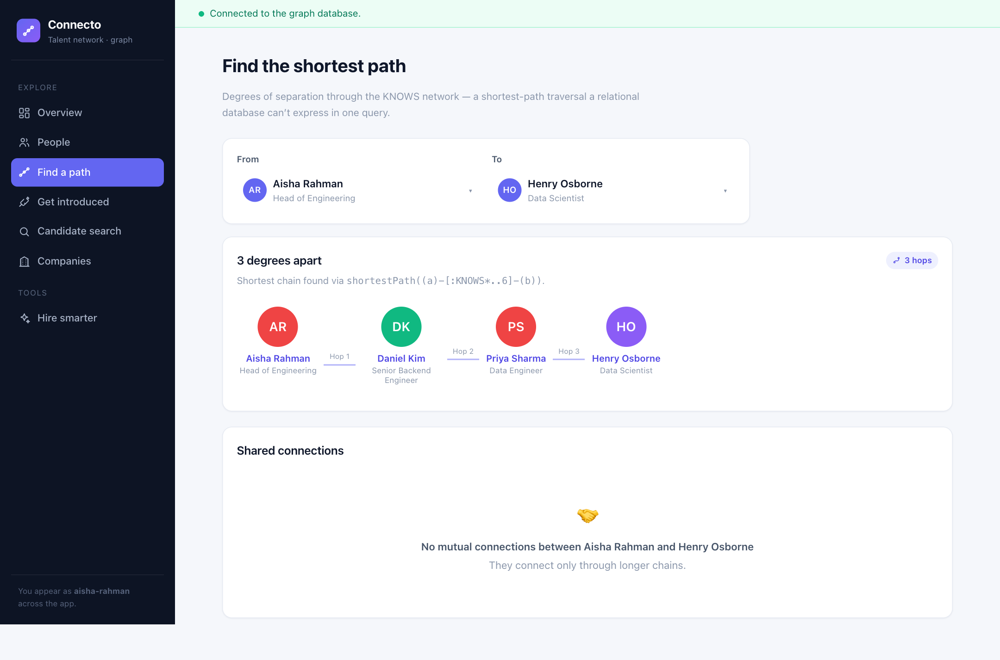
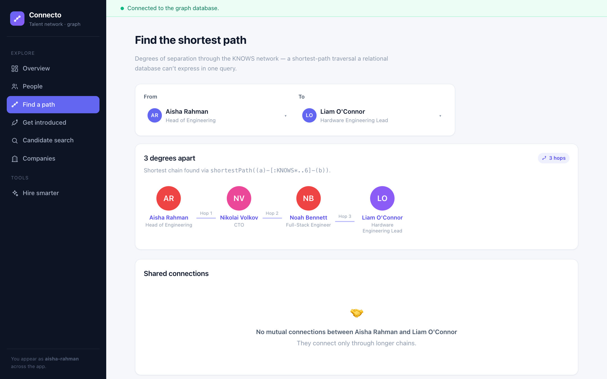
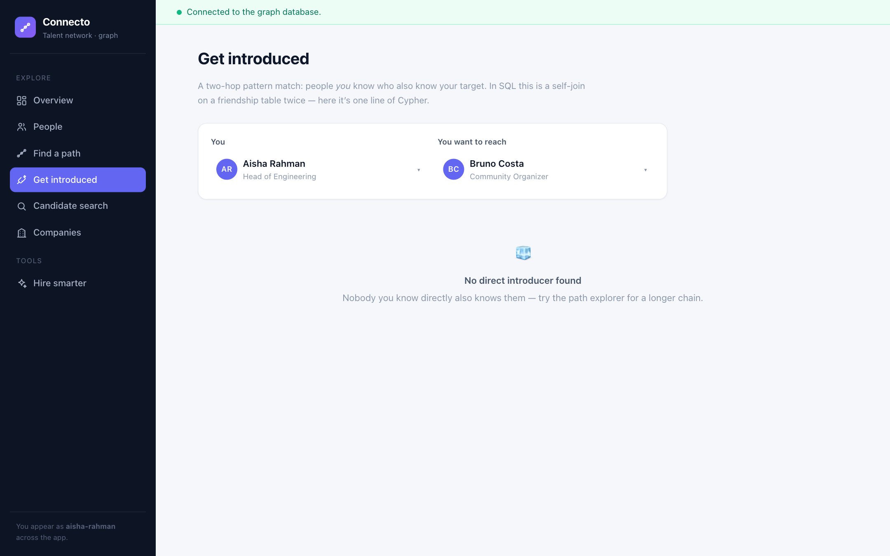
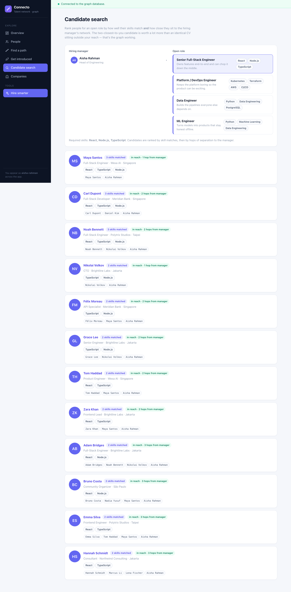
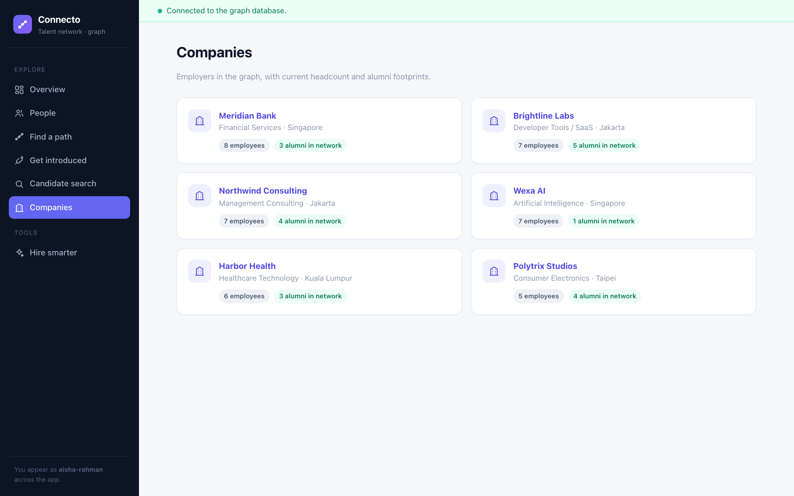
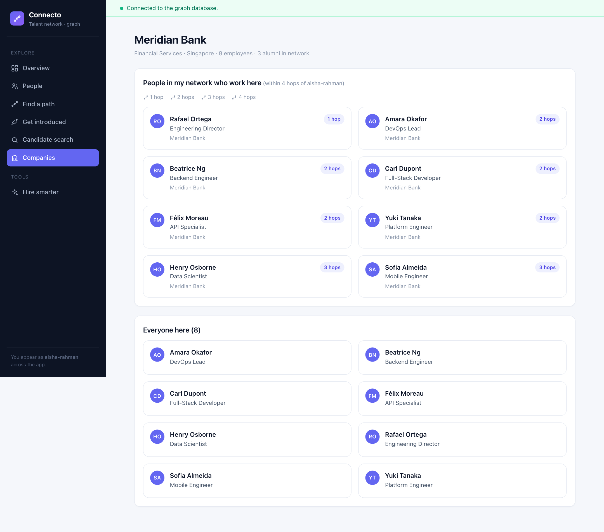

# Connecto — a talent referral network backed by a graph database

Connecto is a small, complete web application that models **professional relationships** as a graph. It answers
questions you can't reasonably express in SQL — *who can introduce me to this person?*, *how close is this candidate
to my team's managers?*, *whose network should I hire through next?* — using a live graph database
([**CognoDB**](https://cognodb.com), which speaks openCypher over the Bolt protocol).

Built for the **Wexa AI full-stack take-home assignment**. Submitted by **Hermawan Prabowo** — submitted to Wexa HR under subject
line **"CognoDB Assignment 2 – Hermawan Prabowo"**.

- **Data layer:** CognoDB (managed graph DB, openCypher over Bolt 5.x), queried with the official
  [`neo4j-driver`](https://www.npmjs.com/package/neo4j-driver) for Node.js. No custom SDK.
- **Backend:** Node.js + Express + the official driver, layered as `routes → repo → queries`.
- **Frontend:** React + Vite SPA with a focused, intentional UI (loading / empty / error states included).
- **Seed data:** a 45-person, 150-connection network across 6 companies, loaded by an idempotent script.

---

## Why a graph database?

The whole point of this app is **relationships between people**. Every interesting question is a *traversal* of the
knows-network, not a lookup of rows.

Three questions the app answers that a relational schema would sweat over:

1. **"How many degrees apart are two people?"**
   → `shortestPath((a)-[:KNOWS*..6]-(b))`. In SQL this is a recursive CTE with a penalty for correctness (BFS
   shortest-path with bounded depth and visited-set pruning is genuinely painful and slow as depth grows). In a graph
   it's one expression; the engine does the path-finding natively.

2. **"Who can introduce me to person X?"**
   → a two-hop pattern `((me)-[:KNOWS]-(m)-[:KNOWS]-(X))`. In SQL: two *self-joins* on a `friendships` table with
   direction-aware predicates, plus dedup. In Cypher: a single pattern where `m` is *any* node that satisfies both
   hops. Pattern matching is the query, not a chain of joins.

3. **"Rank candidates for a role by skill match *and* how close they sit to the hiring manager."**
   → combine a skill match with `shortestPath((candidate)-[:KNOWS*..4]-(manager))` **in one pattern**, then order by
   `matchedSkills DESC, hops ASC`. A recruiter's informal "I'd rather hire someone my team can reach" becomes a
   query. Recreating this in SQL requires materialising all-pairs shortest paths or N recursive CTEs.

> A relational design would work, of course — most things do. But here the *query shapes are the domain model*:
> paths, community closeness and introductions map 1:1 onto Cypher, stay fast on modest hardware, and read like the
> problem being asked. That's where the graph genuinely earns its place. Joins are for tabular questions; this is a
> connected-questions app.

---

## Data model

```
(:Person)  -[:KNOWS {strength 1..5}]->     (:Person)
(:Person)  -[:WORKS_AT {role}]->           (:Company)
(:Person)  -[:WORKED_AT {role, from, to}]-> (:Company)    (past roles)
(:Person)  -[:HAS_SKILL {proficiency 1..5}]-> (:Skill)
```

```
                    ┌──────────┐
                    │ COMPANIES │
                    └────┬─────┘
                         │ WORKS_AT / WORKED_AT (role, from, to)
       ┌─────────────────┴────────────────┐
       │                                  │
 ┌─────┴──────┐   KNOWS (strength)  ┌─────┴──────┐
 │  :Person   │◄────────────────────► :Person     │
 └─────┬──────┘                     └─────┬──────┘
       │ HAS_SKILL (proficiency)          │
 ┌─────┴──────┐                          ...
 │  :Skill    │
 └────────────┘
```

**Node labels**

| Label      | Properties | Purpose |
|------------|-----------|---------|
| `Person`   | id, name, title, email, location, yearsExperience, summary, avatarColor | the network's members |
| `Company`  | id, name, industry, location | employers |
| `Skill`    | name, category | competencies |

**Relationship types**

| Type | Properties | Meaning |
|------|-----------|---------|
| `KNOWS` | strength (1–5) | professional acquaintance; **traversed undirected** |
| `WORKS_AT` | role | current employment |
| `WORKED_AT` | role, from, to | past employment |
| `HAS_SKILL` | proficiency (1–5) | attested competency |

Design choices worth defending:

- **`KNOWS` is stored once but queried undirected** (`-[:KNOWS]-`). Direction is meaningless for "who can introduce
  me", and storing each friendship twice is redundant. Undirected matching at query time is idiomatic Neo4j practice.
- **Strength lives on the relationship, not the person.** How well A knows B is a property of the *pair* — exactly
  what relationship properties are for — and lets ranking mix "knows me well" + "knows target well".
- **Skills are nodes, not strings.** That lets `HAS_SKILL` carry proficiency and lets skills be shared/traversed
  instead of embedded blobs.

---

## The main queries (parameterised, no string concatenation)

All Cypher lives in [`server/src/queries.js`](server/src/queries.js) and every query takes `$parameters`.

| Endpoint | Query | Why it's the interesting one |
|---|---|---|
| `GET /api/network/path?from=&to=` | `shortestPath((a)-[:KNOWS*..6]-(b))` | **multi-hop** degrees of separation |
| `GET /api/network/introducers?from=&to=` | `(me)-[:KNOWS]-(m)-[:KNOWS]-(target)` | **two-hop** intro pattern, SQL = two self-joins |
| `GET /api/network/mutual?from=&to=` | `(a)-[:KNOWS]-(m)-[:KNOWS]-(b)` | shared connections |
| `GET /api/network/company?me=&companyId=` | `shortestPath((me)-[:KNOWS*..4]-(p:Person))-[:WORKS_AT]->(co)` | "who in my orbit works there" — **multi-hop** |
| `GET /api/recommendations?managerId=&skills=` | skill match `⋈` `shortestPath((c)-[:KNOWS*..4]-(manager))`, order by `matchedSkills DESC, hops ASC` | candidate ranking the relational way can't reach |
| `GET /api/stats` | several pattern counts + degree centrality (most connections) | graph-native analytics |

Example — the shortest-path query:

```cypher
MATCH (a:Person {id: $from})
MATCH (b:Person {id: $to})
WHERE a <> b
MATCH p = shortestPath((a)-[:KNOWS*..6]-(b))
RETURN length(p) AS degrees,
       [n IN nodes(p) | {id: n.id, name: n.name, title: n.title, avatarColor: n.avatarColor}] AS path
```

Example — candidate recommendation (skill match + managerial network distance, one pattern):

```cypher
MATCH (hm:Person {id: $managerId})
MATCH (c:Person)-[hs:HAS_SKILL]->(s:Skill)
WHERE s.name IN $skills AND c <> hm
WITH c, hm, collect(DISTINCT s.name) AS has, count(DISTINCT hs) AS matchedSkills
OPTIONAL MATCH path = shortestPath((c)-[:KNOWS*..4]-(hm))
WITH c, has, matchedSkills, collect(DISTINCT path) AS paths
OPTIONAL MATCH (c)-[:WORKS_AT]->(cc)
RETURN c, cc, matchedSkills, has,
       CASE WHEN size(paths) = 0 THEN null ELSE length(head(paths)) END AS hops,
       CASE WHEN size(paths) = 0 THEN [] ELSE [n IN nodes(head(paths)) | {id: n.id, name: n.name}] END AS route
ORDER BY matchedSkills DESC, CASE WHEN hops IS NULL THEN 1 ELSE 0 END ASC, hops ASC, c.name
```

> Two CognoDB quirks handled here: (1) we store `KNOWS` once and match **undirected**, so paths work no matter which
> direction an edge was created in; (2) `shortestPath` can return multiple equally-short paths, so we `collect` them
> and dedupe per pair to avoid duplicate rows.

---

## Project structure

```
.
├── client/                      # React + Vite SPA
│   └── src/
│       ├── App.jsx              # layout, nav, persona context, routes
│       ├── api.js               # fetch wrapper + health probe
│       ├── hooks.js             # useFetch, useDbHealth
│       ├── components/          # Avatar, PersonCard, PersonPicker, PathChain, states, icons
│       └── pages/               # Dashboard, People, Person, Paths, Introductions, Recommendations, Companies, Company
├── server/                      # Express API
│   └── src/
│       ├── index.js             # app boot, CORS, health, 404 + error handling
│       ├── config.js            # env-driven config (fails loudly if missing)
│       ├── db.js                # neo4j driver, runQuery + Integer→number coercion, unavailable handling
│       ├── queries.js           # ALL Cypher, parameterised
│       ├── repo.js              # composes query results into API payloads
│       ├── routes/              # people, companies, network, recommendations, stats
│       ├── seed.js              # idempotent seed loader
│       └── data/seed-data.js    # realistic 45-person network
├── docs/screenshots/            # UI screenshots for this README
├── .env.example                 # env template (never commit real .env)
└── package.json                 # npm workspaces (server + client)
```

---

## 1. Create the CognoDB instance

1. Go to **https://console.cognodb.com/signup** and create an account (free tier, no credit card).
2. Create a **free (c0)** instance and pick a region — it provisions in under a minute.
3. Copy the **connection URI** `bolt+s://<instance-id>.databases.cognodb.com` and the once-shown **password** for user
   `cognodb`. Store the password somewhere safe now.

> This project uses the standard Neo4j driver, which CognoDB supports out of the box (Bolt 5.0–5.4 + openCypher).
> If you hit signup / provisioning issues, email cognodb@wexa.ai.

## 2. Configure & install

```bash
# clone / copy the repo, then:
cp .env.example .env          # edit with your real URI + password
npm install                   # installs server + client (workspaces)
```

Set in `.env`:

```
NEO4J_URI=bolt+s://<your-instance-id>.databases.cognodb.cloud
NEO4J_USER=cognodb
NEO4J_PASSWORD=<your-generated-password>
```

> **Secrets**: `.env` is git-ignored. Only `.env.example` is committed.

## 3. Load the seed data

```bash
npm run seed
```

Idempotent — safe to run repeatedly. Loads 45 people, 6 companies, 18 skills and ~150 `KNOWS` edges.

## 4. Run the app

```bash
npm run dev        # concurrently: API on :4000 (http://localhost:4000/api) + UI on :5173
```

Open **http://localhost:5173**. Production:

```bash
npm run build      # outputs static frontend to client/dist
npm start          # serves the API; point a static host at client/dist
```

---

## 🚀 Live demo (hosted on Vercel)

**https://connecto-wexa.vercel.app**
Deployed as a single Vercel serverless function: the Express app serves **both** the `/api/*` endpoints and the built
frontend (static assets + SPA fallback). Connection details are injected as Vercel environment variables — nothing is
committed.

Re-deploy (from this repo root):

```bash
vercel login                 # once
npm run build -w client      # ensures client/dist is fresh (used by the function)
vercel deploy --prod --yes   # uploads + builds + deploys
```

Environment variables configured on the Vercel project: `NEO4J_URI`, `NEO4J_USER`, `NEO4J_PASSWORD`
(`.vercelignore` keeps the real `.env` off the deployment).

---

## Screenshots

| Overview | People directory |
|---|---|
|  |  |

| Person profile | Shortest path: Aisha → Henry (3 hops) |
|---|---|
|  |  |

| Another path: Aisha → Liam (3 hops) | Introductions (empty state) |
|---|---|
|  |  |

| Candidate search (ranked by skills + reach) | Companies directory |
|---|---|
|  |  |

| Company page — "who in my network works here" |
|---|
|  |

---

## Engineering notes

- **Graceful degradation.** The client polls `GET /api/health`; when the DB is unreachable you get a clear banner and
  friendly "database unreachable" states instead of a crash. The API returns `503` for connectivity problems and maps
  query bugs to `500 query_failed` — never a raw stack trace.
- **No string-concatenated Cypher.** Every query takes parameters; nothing user-controlled ever touches the query
  string.
- **Neo4j `Integer` coercion.** All driver values are recursively converted to plain JS numbers before they hit JSON,
  so the API returns `5`, not `{low:5, high:5}`.
- **Layering.** `routes → repo → queries/db`. A page maps to one route file; a route maps to one repo method; a repo
  method maps to one (or a few) named Cypher strings.

## That's it

This is a deliberately small but *complete* loop: schema → realistic data → graph-native queries → a usable UI.
The design decisions section of the README is where I'd argue the graph earns its keep in an interview.